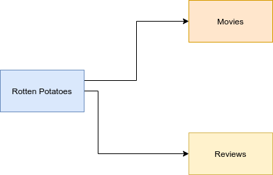

# kubedev-desafio-microservico

Desafio final do modulo de docker. O objetivo deste desafio é levantar uma aplicação que utiliza micro serviços sendo 3 aplicações, cada aplicação possui suas particularidade como, banco de dados específicos e desenvolvida com linguagem diferentes.

## Requisitos para o projeto

  - Trabalhar com arquivos de enviroment separada e dar liberdade para os desenvolvedores.
  - Todo o ambiente deve ser iniciada a partir de um único comando.
  - As imagem geradas tem que trabalhar sempre com a mesma versão.
  - Criar todo ambiente a partir de um Docker-compose.

## Diagrama do projeto 

## Informações do projeto

  Este projeto é composto de três diretório cada diretório é um projeto separado.
  - movie
    - Aplicação responsável pelo catálogo dos filmes.
    - Aplicação desenvolvida em **node:17**
      - Porta *default* *8181*
      - Start pelo *server.js*
    - Necessita de banco NoSQL **mongodb**
  - review
    - Aplicação responsável pela informações 
    - Aplicação desenvolvida em **asp.net versão 5**
      - Deve rodar na porta *default* **8282**
      - Variável que define porta  asp.net *ASPNETCORE_URLS=http://+:8282*
    - Necessita do Banco SQL **postgreSQL**
  - rotten-potatoes-ms
    - Aplicação responsável pelo frontend.
    - Conecta via url nas aplicações de backend
    - Aplicação feito em **python 3.10.1** com flask
      - Porta *default* do python **5000**

## Arquivo de Environment

  - *env.compose*
    - responsável por definir as versões das imagem no docker-compose
  - */movie/src/env*
    - responsável por definir o Environment da aplicação movie.
  - */review/env*
    - responsável por definir o Environment da aplicação review.
  - /rotten-potatoes-ms/src/env
    - responsável por definir o Environment de conexão do frontend.

## Comando iniciar o projeto e monitoramento

  - *Iniciar a aplicação*
    >docker-compose --env-file env.compose  up -d --build
  - *Verificar os logs das aplicações*
    >docker-compose logs
    >
    >docker-compose logs -f
  - *Verificar os estado das aplicações"
    >docker-compose ps
  - *Encerrar todo o ambiente*
    >docker-compose --env-file env.compose  down
